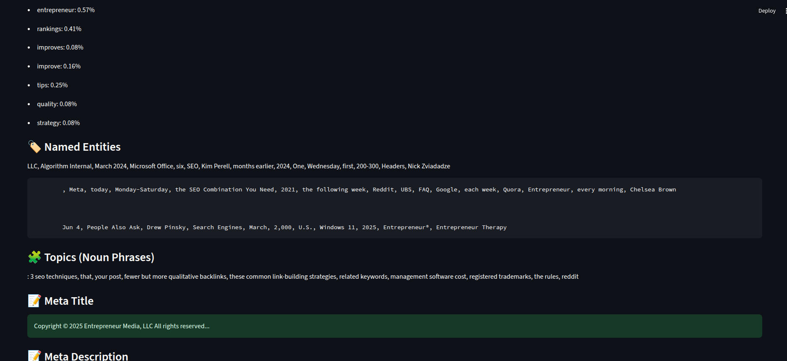
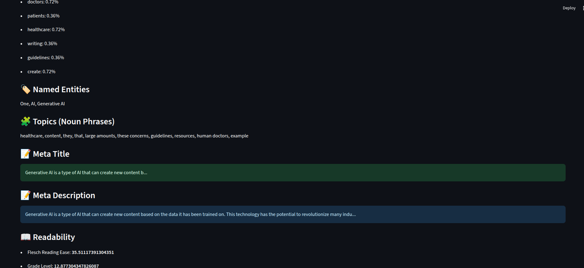

# 🔍 SEO Content Intelligence Tool

An AI-powered web tool that analyzes blog articles or URLs to extract SEO-friendly insights using advanced NLP techniques. Built with Streamlit, spaCy, KeyBERT, and sentence-transformers.

---

## 🚀 Live Demo

👉 [Click here to try the app](http://13.233.91.184:8501/)  
*(Deployed On Amazon EC2)*

---

## 🎯 Features

✅ Accepts:
- Pasted blog/article content  
- Blog URL (auto-scraped)  
- Uploaded `.txt` or `.docx` files  

✅ Outputs:
- Top SEO Keywords (via KeyBERT)  
- Keyword Density (%)  
- Named Entities (via spaCy)  
- Topic Extraction (Noun Phrases)  
- SEO Meta Title & Description Suggestions  
- Readability Score (Flesch Reading Ease + Grade Level)

✅ Extras:
- Competitor SEO Comparison (between 2 URLs)  
- Downloadable CSV report

---

## 🧠 Tech Stack

- **Python 3.10+**
- **Streamlit** (Web UI)
- **spaCy** (`en_core_web_sm`)
- **KeyBERT** + `all-MiniLM-L6-v2`
- **Sentence Transformers**
- **BeautifulSoup** (Web scraping)
- **textstat** (Readability analysis)
- **pandas** (CSV export)

---

## 🛠️ Installation (Local)

**1. Clone the repository:**

```bash
git clone https://github.com/your-username/seo-content-tool.git
cd seo-content-tool
```

**2. Create and activate a virtual environment:**

```bash
python -m venv venv
source venv/bin/activate  # Windows: venv\Scripts\activate
```

**3. Install dependencies:**

```bash
pip install -r requirements.txt
python -m spacy download en_core_web_sm
```

**4. Run the app:**

```bash
streamlit run app.py
```

## 📁 Folder Structure
```
seo-content-tool/
├── app.py
├── requirements.txt
└── README.md
```

## 📸 Screenshots

## 📸 Screenshot

#### **1. Home Page**


#### **2. Single Content Analysis**

**-- Paste Text**


**-- Enter URL**





**-- Upload File**





 #### **3. Competitor Comparison**


